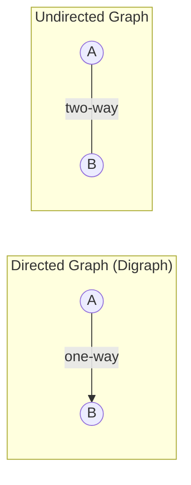
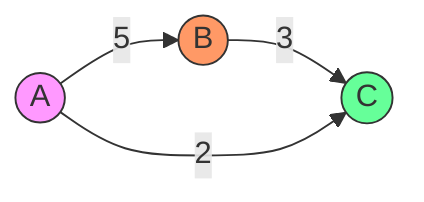
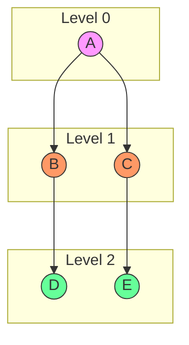
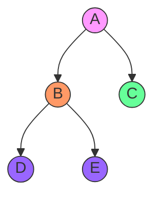

# Comprehensive Graph Algorithms Guide

## Theoretical Foundations of Graph Theory

### 1. Mathematical Definition and Properties

A graph G is formally defined as an ordered pair G = (V, E) where:
- V is a set of vertices (also called nodes)
- E is a set of edges, where each edge is a pair (u, v) of vertices

In mathematical notation, we write G = (V, E) to represent a graph structure. This abstraction allows us to model complex relationships between entities in a wide variety of domains, from computer networks to social relationships.

#### 1.1 Essential Properties

1. **Order of a Graph**: |V| - number of vertices
   - Represents the total number of entities in the system being modeled
   - Example: In a social network with 1 million users, |V| = 1,000,000

2. **Size of a Graph**: |E| - number of edges
   - Represents the total number of relationships in the system
   - Example: In a road network, |E| would be the total number of road segments

3. **Density**: The ratio of actual edges to potential edges
   - For undirected graphs: 2|E| / (|V|(|V|-1))
   - For directed graphs: |E| / (|V|(|V|-1))
   - Sparse graphs: Density approaches 0 as |V| increases
   - Dense graphs: Density approaches 1
   - Complete graphs: Density = 1 (every possible edge exists)

4. **Degree of a Vertex**: Number of edges connected to a vertex
   - For undirected graphs: deg(v) = number of adjacent vertices
   - For directed graphs: 
     - in-degree(v) = number of incoming edges
     - out-degree(v) = number of outgoing edges
     - total-degree(v) = in-degree(v) + out-degree(v)

5. **Path**: A sequence of vertices where each adjacent pair is connected by an edge
   - A path of length n contains n+1 vertices and n edges
   - Simple path: No repeated vertices
   - Cycle: Path that starts and ends at the same vertex

6. **Connectivity**:
   - Connected graph: There exists a path between any two vertices
   - Strongly connected (directed graphs): There exists a directed path between any two vertices in both directions
   - Weakly connected (directed graphs): The underlying undirected graph is connected

### 2. Real-World Applications and Modeling

Graphs serve as powerful mathematical models for various real-world systems:

#### 2.1 Social Networks
- **Vertices**: Individual users/profiles
- **Edges**: Relationships/connections
- **Properties**: Often exhibits "small-world" characteristics
- **Mathematical Model**: G = (U, F) where U is the set of users and F represents friendships
- **Advanced Analysis**: 
  - Community detection using clustering algorithms
  - Influence propagation modeling
  - Six degrees of separation phenomenon
  - Centrality measures to identify key influencers

#### 2.2 Transportation Networks
- **Vertices**: Cities, intersections, airports
- **Edges**: Roads, flight routes
- **Weights**: Distances, travel times, costs
- **Mathematical Model**: G = (L, R, W) where L is locations, R is routes, W is weights
- **Practical Applications**:
  - GPS navigation systems
  - Traffic flow optimization
  - Public transportation planning
  - Supply chain logistics
  - Emergency response routing

#### 2.3 Computer Networks
- **Vertices**: Devices, servers, routers
- **Edges**: Physical or logical connections
- **Weights**: Bandwidth, latency
- **Mathematical Model**: G = (D, C, B) where D is devices, C is connections, B is bandwidth
- **Network Analysis**:
  - Routing protocol optimization
  - Network reliability assessment
  - Bottleneck identification
  - Fault tolerance planning
  - Security vulnerability mapping

### 3. Graph Classifications and Properties

#### 3.1 Directed vs Undirected Graphs



**Mathematical Properties:**
- Directed: E ⊆ V × V (ordered pairs)
  - Relationships have direction (e.g., following someone on Twitter)
  - Can model asymmetric relationships
  - Applications: Web page links, email communications, citation networks

- Undirected: E contains unordered pairs
  - Relationships are bidirectional (e.g., friendship on Facebook)
  - Symmetric by definition
  - Applications: Road networks, physical infrastructure, mutual relationships

**Formal Representation:**
- Directed: Edge (u,v) ≠ Edge (v,u)
- Undirected: Edge {u,v} = Edge {v,u}

#### 3.2 Weighted vs Unweighted

**Formal Definition:**
A weighted graph G = (V, E, w) where w: E → ℝ is a weight function



**Characteristics:**
- **Weighted Graphs**:
  - Edges have associated values (weights)
  - Weights can represent distance, cost, capacity, etc.
  - Critical for optimization problems
  - Examples: Road networks with distances, network links with bandwidth

- **Unweighted Graphs**:
  - All edges have equal importance
  - Simpler to analyze for certain problems
  - Can be viewed as weighted graphs where all weights = 1
  - Examples: Social connections, binary relationships

#### 3.3 Special Graph Types

1. **Complete Graph (Kₙ)**:
   - Every vertex is connected to every other vertex
   - |E| = n(n-1)/2 for undirected graphs
   - Density = 1

2. **Bipartite Graph**:
   - Vertices can be divided into two disjoint sets U and V
   - Every edge connects a vertex in U to a vertex in V
   - No edges within the same set
   - Applications: Matching problems, assignment problems

3. **Tree**:
   - Connected, undirected graph with no cycles
   - |E| = |V| - 1
   - Exactly one path between any two vertices
   - Applications: Hierarchical structures, decision trees

4. **Planar Graph**:
   - Can be drawn on a plane with no edge crossings
   - |E| ≤ 3|V| - 6 for |V| ≥ 3
   - Applications: Circuit design, map coloring

5. **DAG (Directed Acyclic Graph)**:
   - Directed graph with no cycles
   - Can be topologically sorted
   - Applications: Scheduling, dependency resolution, version control

## Graph Traversal Algorithms

### 1. Breadth-First Search (BFS)

#### 1.1 Theoretical Foundation

BFS is based on the principle of level-order traversal, exploring all vertices at the current depth before moving to vertices at the next depth level. It uses a queue data structure to maintain the order of exploration.

**Key Properties:**
- Guarantees shortest path in unweighted graphs
- Explores vertices in order of their distance from the source
- Builds a breadth-first tree that preserves shortest paths
- Useful for finding connected components

**Time Complexity:** O(V + E)
**Space Complexity:** O(V)

#### 1.2 Algorithm Specification

```python
def bfs(graph: Dict[Any, List[Any]], start: Any) -> List[Any]:
    """
Performs Breadth-First Search traversal on a graph.
    
    Args:
        graph: Dictionary representing adjacency list
        start: Starting vertex
        
    Returns:
        List of vertices in BFS order
        
    Time Complexity: O(V + E)
    Space Complexity: O(V)
    """
    visited = set()          # O(1) initialization
    queue = deque([start])   # O(1) initialization
    result = []             # O(1) initialization
    
    while queue:            # O(V) iterations
        current = queue.popleft()  # O(1) operation
        
        if current not in visited:
            visited.add(current)    # O(1) operation
            result.append(current)  # O(1) operation
            
            # Add all unvisited neighbors
            for neighbor in graph[current]:  # O(E) total across all iterations
                if neighbor not in visited:
                    queue.append(neighbor)   # O(1) operation
    
    return result
```

**Implementation Details:**
- The `visited` set ensures each vertex is processed exactly once
- The queue enforces the level-order traversal property
- Each edge is examined exactly once in an undirected graph, and at most twice in a directed graph

#### 1.3 Step-by-Step Example

Consider this graph:


Detailed execution trace:
1. Start at A:
   - Queue: [A]
   - Visited: {}
   - Result: []

2. Process A:
   - Queue: [B, C]
   - Visited: {A}
   - Result: [A]

3. Process B (first neighbor of A):
   - Queue: [C, D]
   - Visited: {A, B}
   - Result: [A, B]

4. Process C (second neighbor of A):
   - Queue: [D, E]
   - Visited: {A, B, C}
   - Result: [A, B, C]

5. Process D (neighbor of B):
   - Queue: [E]
   - Visited: {A, B, C, D}
   - Result: [A, B, C, D]

6. Process E (neighbor of C):
   - Queue: []
   - Visited: {A, B, C, D, E}
   - Result: [A, B, C, D, E]

7. Queue is empty, algorithm terminates
   - Final result: [A, B, C, D, E]

#### 1.4 Real Implementation Analysis

From the actual implementation in `BFS_list_graph.py`:

```python
def bfs(graph, start_vertex):
    if start_vertex not in graph.graph:
        return []

    visited = set()
    queue = deque([start_vertex])
    visited.add(start_vertex)  # Note: Mark as visited when added to queue
    traversal_order = []

    while queue:
        vertex = queue.popleft()
        traversal_order.append(vertex)

        for neighbor in graph.graph[vertex]:
            if neighbor not in visited:
                visited.add(neighbor)
                queue.append(neighbor)

    return traversal_order
```

Key differences from the pseudocode:
1. Vertices are marked as visited when they're added to the queue, not when processed
2. Input validation to handle non-existent start vertices
3. The implementation handles the graph as an object with a `.graph` attribute

### 2. Depth-First Search (DFS)

#### 2.1 Theoretical Foundation

DFS explores as far as possible along each branch before backtracking, following the principle of exploring depth before breadth. It can be implemented recursively (using the call stack) or iteratively (using an explicit stack).

**Key Properties:**
- Useful for topological sorting, cycle detection, and connected component analysis
- Explores all possible paths from source to destination
- Memory-efficient for deep graphs
- Forms a depth-first forest

**Time Complexity:** O(V + E)
**Space Complexity:** O(V) - worst case for recursive call stack

#### 2.2 Algorithm Specification

```python
def dfs_recursive(graph: Dict[Any, List[Any]], 
                  node: Any,
                  visited: Set[Any] = None,
                  path: List[Any] = None) -> List[Any]:
    """
Performs Depth-First Search traversal recursively.
    
    Args:
        graph: Dictionary representing adjacency list
        node: Current vertex
        visited: Set of visited vertices
        path: List to store traversal order
        
    Returns:
        List of vertices in DFS order
        
    Time Complexity: O(V + E)
    Space Complexity: O(V) - due to recursion stack
    """
    # Initialize on first call
    if visited is None:
        visited = set()
    if path is None:
        path = []
    
    # Process current node
    visited.add(node)    # O(1) operation
    path.append(node)    # O(1) operation
    
    # Recursively process neighbors
    for neighbor in graph[node]:  # O(E) total across all calls
        if neighbor not in visited:
            dfs_recursive(graph, neighbor, visited, path)
    
    return path
```

**Implementation Details:**
- The recursive approach leverages the system's call stack
- Each vertex is visited exactly once
- The recursion depth can be at most V (in the case of a linear graph)
- Default parameters allow for clean initial calls

#### 2.3 Iterative Implementation

```python
def dfs_iterative(graph: Dict[Any, List[Any]], start: Any) -> List[Any]:
    """Performs Depth-First Search traversal iteratively.
    
    Args:
        graph: Dictionary representing adjacency list
        start: Starting vertex
        
    Returns:
        List of vertices in DFS order
        
    Time Complexity: O(V + E)
    Space Complexity: O(V)
    """
    visited = set()
    stack = [start]
    path = []
    
    while stack:  # O(V) iterations
        node = stack.pop()  # O(1) operation
        
        if node not in visited:
            visited.add(node)    # O(1) operation
            path.append(node)    # O(1) operation
            
            # Add neighbors in reverse order
            for neighbor in reversed(graph[node]):  # O(E) total
                if neighbor not in visited:
                    stack.append(neighbor)  # O(1) operation
    
    return path
```

#### 2.4 Comparative Analysis

Let's analyze a sample graph:


Recursive DFS Trace:
1. Visit A → push to stack
2. Visit B (A's first neighbor)
3. Visit D (B's first neighbor)
4. Backtrack to B (D has no unvisited neighbors)
5. Visit E (B's second neighbor)
6. Backtrack to A (B has no more unvisited neighbors)
7. Visit C (A's second neighbor)

### 3. Advanced Applications

#### 3.1 Social Network Analysis

```python
# Example: Finding all friends within 2 degrees
def find_friends_of_friends(network, start_user):
    """Finds all friends and friends-of-friends.
    
    Args:
        network: Social network graph
        start_user: Starting user
        
    Returns:
        Dict with degrees of connection
    """
    degrees = {start_user: 0}
    queue = deque([(start_user, 0)])
    
    while queue:
        user, degree = queue.popleft()
        
        if degree < 2:  # Only explore up to friends-of-friends
            for friend in network[user]:
                if friend not in degrees:
                    degrees[friend] = degree + 1
                    queue.append((friend, degree + 1))
    
    return degrees

# Example usage
network = {
    'Alice': ['Bob', 'Charlie'],
    'Bob': ['Alice', 'David'],
    'Charlie': ['Alice', 'Eve'],
    'David': ['Bob'],
    'Eve': ['Charlie']
}

connections = find_friends_of_friends(network, 'Alice')
# Result: {'Alice': 0, 'Bob': 1, 'Charlie': 1, 'David': 2, 'Eve': 2}
```

#### 3.2 Maze Solving

```python
def solve_maze(maze, start, end, path=None):
    """Solves a maze using DFS.
    
    Args:
        maze: Dictionary representing possible moves
        start: Starting position
        end: Target position
        path: Current path being explored
        
    Returns:
        List representing solution path, or None if no solution
    """
    if path is None:
        path = []
    
    path.append(start)
    
    if start == end:
        return path
    
    for next_pos in maze[start]:
        if next_pos not in path:
            solution = solve_maze(maze, next_pos, end, path.copy())
            if solution:
                return solution
    
    return None

# Example usage
maze = {
    'Start': ['A', 'B'],
    'A': ['Start', 'C'],
    'B': ['Start', 'D'],
    'C': ['A', 'End'],
    'D': ['B', 'End'],
    'End': ['C', 'D']
}

solution = solve_maze(maze, 'Start', 'End')
# Possible result: ['Start', 'A', 'C', 'End']
```

### 4. Debugging and Optimization Tips

#### 4.1 Common Implementation Pitfalls

1. **Infinite Loops**
   - Always maintain a visited set
   - Ensure proper neighbor handling

2. **Memory Leaks**
   - Clear data structures after use
   - Use appropriate data structure sizes

#### 4.2 Performance Optimization

1. **Space Optimization**
   ```python
   # Instead of storing full paths
   parent = {start: None}  # Store parent references
   
   # Reconstruct path when needed
   def get_path(end):
       path = []
       current = end
       while current is not None:
           path.append(current)
           current = parent[current]
       return path[::-1]
   ```

2. **Time Optimization**
   ```python
   # Use set for O(1) lookup
   visited = set()
   
   # Use deque for O(1) append/pop
   from collections import deque
   queue = deque()
   ```

Remember: The choice between BFS and DFS often depends on the specific problem requirements and constraints. BFS is typically better for shortest path problems in unweighted graphs, while DFS is often preferred for exhaustive search problems and topological sorting.

## Advanced Graph Algorithms

### 1. Topological Sorting

#### 1.1 Theoretical Foundation

Topological sorting is a linear ordering of vertices in a directed acyclic graph (DAG) such that for every directed edge u→v, vertex u comes before v in the ordering.

**Applications:**
- Task scheduling
- Build systems
- Course prerequisites

**Implementation Files:**
- Basic DFS-based implementation: `topological_sort.py`
- Kahn's Algorithm implementation: `topological_sort_kahns_algorithm.py`

#### 1.2 Algorithm Variants

##### A. DFS-Based Approach
```python
def topological_sort(graph, start, visited=None, stack=None):
    """DFS-based topological sort.
    
    Time Complexity: O(V + E)
    Space Complexity: O(V)
    """
    if visited is None:
        visited = set()
    if stack is None:
        stack = []
    
    visited.add(start)
    
    for neighbor in graph[start]:
        if neighbor not in visited:
            topological_sort(graph, neighbor, visited, stack)
    
    stack.insert(0, start)
    return stack
```

##### B. Kahn's Algorithm
```python
def kahn_topological_sort(graph):
    """Kahn's algorithm for topological sorting.
    
    Time Complexity: O(V + E)
    Space Complexity: O(V)
    """
    in_degree = {node: 0 for node in graph}
    for node in graph:
        for neighbor in graph[node]:
            in_degree[neighbor] += 1
    
    queue = deque([node for node in in_degree if in_degree[node] == 0])
    result = []
    
    while queue:
        node = queue.popleft()
        result.append(node)
        
        for neighbor in graph[node]:
            in_degree[neighbor] -= 1
            if in_degree[neighbor] == 0:
                queue.append(neighbor)
    
    return result
```

### 2. Minimum Spanning Tree (MST)

#### 2.1 Theoretical Foundation

A minimum spanning tree is a subset of edges that connects all vertices with minimum total edge weight.

**Implementation Files:**
- Prim's Algorithm: `minimum_spanning_tree_prims_algorithm.py`
- Kruskal's Algorithm: `minimum_cost_spanning_tree_kruskals_algorithm.py`

#### 2.2 Algorithm Variants

##### A. Prim's Algorithm
```python
def prims_mst(graph):
    """Prim's algorithm for MST.
    
    Time Complexity: O(E log V)
    Space Complexity: O(V)
    """
    start_vertex = list(graph.graph.keys())[0]
    mst_edges = []
    visited = {start_vertex}
    edges = [
        (weight, start_vertex, to)
        for to, weight in graph.graph[start_vertex].items()
    ]
    heapq.heapify(edges)
    
    while edges:
        weight, frm, to = heapq.heappop(edges)
        if to not in visited:
            visited.add(to)
            mst_edges.append((frm, to, weight))
            
            for next_vertex, next_weight in graph.graph[to].items():
                if next_vertex not in visited:
                    heapq.heappush(edges, (next_weight, to, next_vertex))
    
    return mst_edges
```

##### B. Kruskal's Algorithm
```python
def kruskals_mst(graph):
    """Kruskal's algorithm for MST.
    
    Time Complexity: O(E log E)
    Space Complexity: O(V)
    """
    edges = []
    for u in graph:
        for v, weight in graph[u].items():
            edges.append((weight, u, v))
    
    edges.sort()
    parent = {vertex: vertex for vertex in graph}
    mst = []
    
    def find(vertex):
        if parent[vertex] != vertex:
            parent[vertex] = find(parent[vertex])
        return parent[vertex]
    
    def union(u, v):
        parent[find(u)] = find(v)
    
    for weight, u, v in edges:
        if find(u) != find(v):
            union(u, v)
            mst.append((u, v, weight))
    
    return mst
```

### 3. Shortest Path Algorithms

#### 3.1 Theoretical Foundation

Shortest path algorithms find the path between vertices where the sum of edge weights is minimized.

**Implementation Files:**
- Basic implementation: `shortest_path_algorithm.py`
- Dijkstra's Algorithm: `shortest_path_algorithm_dijkstras_algorithm.py`

#### 3.2 Algorithm Variants

##### A. Dijkstra's Algorithm
```python
def dijkstra(graph, start):
    """Dijkstra's shortest path algorithm.
    
    Time Complexity: O((V + E) log V)
    Space Complexity: O(V)
    """
    distances = {vertex: float('infinity') for vertex in graph.graph}
    distances[start] = 0
    pq = [(0, start)]
    predecessors = {vertex: None for vertex in graph.graph}
    
    while pq:
        current_distance, current_vertex = heapq.heappop(pq)
        
        if current_distance > distances[current_vertex]:
            continue
            
        for neighbor, weight in graph.graph[current_vertex].items():
            distance = current_distance + weight
            
            if distance < distances[neighbor]:
                distances[neighbor] = distance
                predecessors[neighbor] = current_vertex
                heapq.heappush(pq, (distance, neighbor))
    
    return distances, predecessors
```

##### B. Path Reconstruction
```python
def get_shortest_path(predecessors, target):
    """Reconstruct shortest path from predecessors.
    
    Time Complexity: O(V)
    Space Complexity: O(V)
    """
    path = []
    current = target
    
    while current is not None:
        path.append(current)
        current = predecessors[current]
    
    return path[::-1]
```

### References

1. Implementation Files:
   - Graph Traversal: `BFS_list_graph.py`, `DFS_list_graph.py`
   - Cycle Detection: `cycle_detection_and_path_directed_graph.py`, `cycle_detection_and_path_undirected_graph.py`
   - Topological Sort: `topological_sort.py`, `topological_sort_kahns_algorithm.py`
   - Minimum Spanning Tree: `minimum_spanning_tree_prims_algorithm.py`, `minimum_cost_spanning_tree_kruskals_algorithm.py`
   - Shortest Path: `shortest_path_algorithm.py`, `shortest_path_algorithm_dijkstras_algorithm.py`

2. Test Files:
   - Complete Test Suite: `_graph_algorithms_test_run.py`
   - Test Graphs: `_test_graph.py`